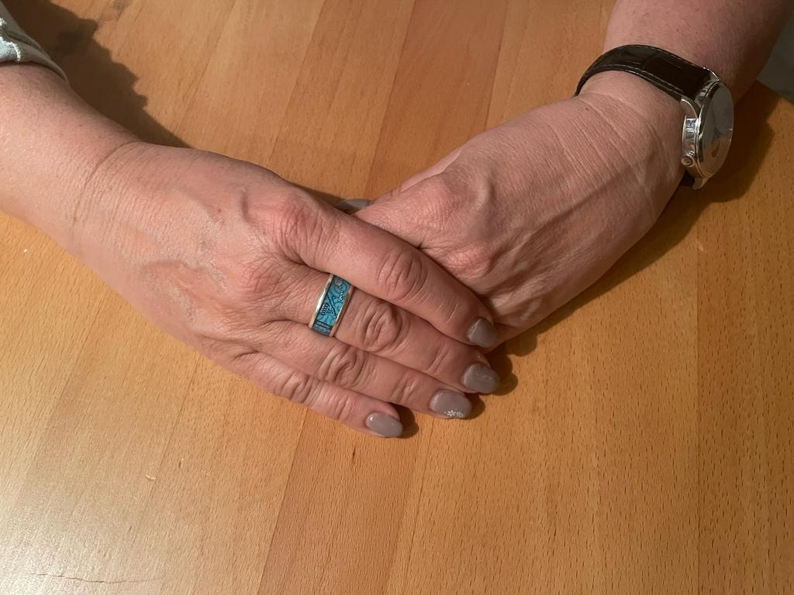

+++
title = "Autismus aus einer anderen Sicht"
date = "2023-05-04"
draft = false
pinned = false
+++
 Auf den ersten Blick scheint Familie Berchthold eine ganz normale Familie zu sein, aber eine Kleinigkeit unterscheidet sie: Ruths älteste Tochter hat eine geistige Beeinträchtigung, eine Autismus-Spektrum-Störung. Das ist eine Einschränkung, die das Gehirn betrifft und dazu führt, dass Sophie Schwierigkeiten hat, mit anderen zu interagieren, Dinge zu verstehen und nachzuvollziehen. Wie ist es jedoch für Ruth, ein Kind aufzuziehen, das anders ist als ihre anderen beiden Kinder? Welche Hürden musste sie überwinden? Wie stellte sie fest, dass Sophie anders ist? Wie hat sie auf die Diagnose reagiert? Alles Fragen, die mir durch den Kopf gehen.

 <!--StartFragment-->



<!--EndFragment-->Ruth (58) wohnt mit ihren drei Kindern im kleinen Dorf Aarwangen im Oberaargau. Sie  arbeitet zusammen mit ihrem Mann als Bäuerin und hat drei Töchter und eine davon ist Sophie (22), Sophie hat Autistische Spektrums Störung. <!--StartFragment-->



<!--EndFragment-->

Als Ruth mir die Tür öffnet, begrüßt sie mich mit einem freundlichen Lächeln und gewährt mir Zutritt zu ihrem Haus. Die Sonne ist bereits am Untergehen und die letzten Strahlen scheinen durch die großen Fenster. Das Haus ist mit vielen Bastelarbeiten der Kinder ausgestattet. Es gibt viele Fotos, einschließlich von Sophie, die eine von 80.000 Autisten in der Schweiz ist.

**Der Weg zur Diagnose**

Wie der Name "Autismus-Spektrum-Störung" sagt, gibt es verschiedene Spektren. Es ist anfangs schwer, sie bei Kindern zu erkennen. Der Kinderpsychiater Leo Kanner meinte, dass es im dritten Lebensjahr des Kindes Anzeichen von Autismus geben könnte. Ruth kann diese These bestätigen. Sie erzählt mir nachdenklich, an einem großen Kirschbaumholztisch gegenüber von mir, dass Sophie erst spät zu sprechen begann, erst etwa mit drei Jahren und deshalb auch eine Sprachtherapeutin konsultierte. Sophies Autismus zeigt sich jedoch nicht nur im sprachlichen Bereich, sondern auch im aktiven Kontakt. Im Kindergarten bemerkten die Betreuenden, dass Sophie Schwierigkeiten hatte, sich zu beteiligen und mit anderen Kindern zu interagieren, was für Ruth schwer zu beurteilen war. Es gibt schließlich auch zurückhaltende Kinder, das ist normal. Ruth macht eine längere Pause und seufzt. Nach der Beurteilung der Betreuenden gingen wir schließlich zur Beziehungs- und Beratungsstelle, die Sophie diagnostizierte. Ruth schaut aus dem Fenster auf einen Apfelbaum, der tot wirkt, da er noch nicht mit Blüten besetzt ist und von einer Straßenlampe beleuchtet wird. Die Sonne ist nun ganz verschwunden. Man kann sehen, dass es Ruth immer noch zum Nachdenken anregt. Schließlich sagt sie mir, dass Sophie mit einer geistigen Behinderung diagnostiziert wurde. Eine genaue Diagnose folgte erst viele Jahre später. Ruth seufzt, während sie mir erzählt, dass sie diese Diagnose nicht erwartet hatte. Obwohl Sophie Schwierigkeiten hatte, sich zu integrieren, auch im sprachlichen Bereich Schwierigkeiten hatte, erlernte sie andere Dinge schnell, z. B. Fahrrad fahren oder andere Aktivitäten. Das sagt Ruth mit einem stolzen Lächeln auf den Lippen.

**Allein auf dem Pausenhof**

 Ruths Lächeln vergeht jedoch, als sie von Sophies Schulzeit erzählt. Kinder mit Autismus-Spektrum-Störung haben in der Schule oft Probleme, sich zu integrieren, was es schwer macht, Freunde zu finden. Eine weitere Schwierigkeit ist, dass sie keine oder eine nur schlecht entwickelte Zeitvorstellung haben. Die betroffenen Personen leiden oft unter Zeitmangel, da es für sie zu schnell geht und sie so den Stoff nicht richtig verstehen. Ruth erzählt mir mit zittriger Stimme, wie sie Sophie oft allein auf dem Pausenhof sah, als sie sie abholen wollte. Sophie konnte die Themen ihrer Klassenkameraden, wie z. B. Schminke oder Jungs, überhaupt nicht nachvollziehen. Sie grenzte sich aus und spielte als sie in der 6. Klasse war lieber mit den Erstklässlern.

 Eine orange Katze strich Ruth ums Bein, als sie mir erzählt, dass sie auch eine heilpädagogische Schule in Betracht zog. Als sie jedoch vor Ort war, erkannte sie schnell, dass Sophie in dieser Schule unterfordert wäre, da es an der HPS viele Kinder mit körperlichen Behinderungen gab, mit viel stärkeren Einschränkungen als Sophie. Die Volksschule war auch keine Option, da es dort keine Kleinklassen mehr gibt und Ruth wusste, dass eine "normale" Klasse Sophie überfordern würde. Also entschied sie sich für die Rudolf-Steiner-Schule, wo Sophie auch unterstützt wurde.

> Es brach mir fast das Herz, als ich Sophie allein auf dem Pausenplatz sah.

**Verurteilende Worte**

Während Ruth aus ihrer Tasse mit Herz-Aufdruck schlürft, kommt mir in den Sinn, dass Sophie noch zwei weitere Geschwister hat. Geschwister von behinderten Kindern haben es oft auch nicht leicht, da das Kind mit Einschränkung oft mehr Aufmerksamkeit bekommt. Ruth meint jedoch, dass Sophie viel schlief und sie während dieser Zeit den anderen beiden gerecht werden konnte. Was schwer war, seufzte Ruth, waren Situationen wie ins Restaurant zu gehen. Neue Situationen im Alltag sind für Autisten immer fordernd, aber letztendlich muss man das auch erlernen.

> Ich wusste nicht, wie ich Sophie helfen konnte und gleichzeitig gerecht gegenüber meinen anderen Kindern sein konnte.

 Ruth sagte etwas früher, dass Sophie keine körperliche Behinderung hat und dass man es ihr nicht ansieht, dass sie Autismus hat. Dies führt, auch in der Öffentlichkeit oft zu Missverständnissen. "Die vielen Eindrücke waren für sie anscheinend sehr schwer zu verarbeiten", sagt Ruth. So ließ sie ihre Überreizung oft an ihren Geschwistern aus, z.B. mit Beissen.

 Ruth atmete aus und schaute auf den Marmorboden. Sie macht eine längere Pause und sagt mit zittriger Stimme, dass die anwesenden Menschen oft sehr negativ reagierten. Oft kamen Sprüche wie "es sei ein verwöhnter Gof" oder "sie hätten sie schon längst zurechtgewiesen", was Ruth offensichtlich sehr traurig machte, da sie ohne Hintergrundwissen der Anderen verurteilt wurde. Vorurteile zu haben ist ein natürlicher Prozess, um Informationen zu kategorisieren. Trotzdem wünscht sich Ruth mehr Verständnis aus der Gesellschaft.

Ruth ist bezüglich Sophie sehr zuversichtlich, da sie Grose Fortschritte macht, wenn auch nicht nach der Norm und auf das ist Ruth sichtlich stolz. Man sieht einen großen Funken Hoffnung in ihren Augen. Plötzlich höre ich die Kirchenglocken schlagen: Boom, boom, boom und das noch weitere sechs Mal. Mir wird bewusst, dass es für mich Zeit ist zu gehen. Da es noch keine Sommerzeit ist, ist es bereits düster und ich kann den abnehmenden Vollmond betrachten, dieser begleitet mich nun nach Hause.