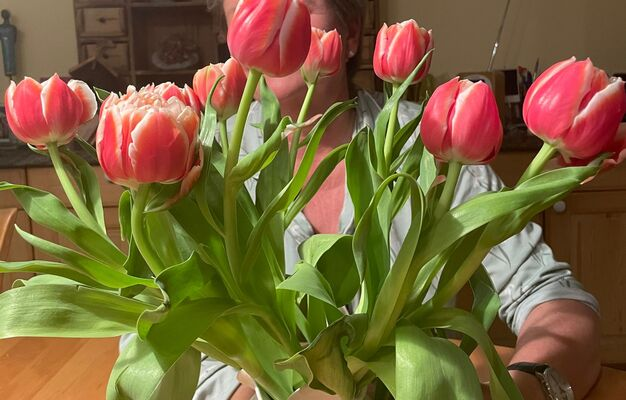

+++
title = "Unser gemeinsamer Weg: Eine Mutter und ihr Kind mit Beeinträchtigung\""
date = "2023-03-19"
draft = false
pinned = false
description = "Ruth Berchtold 58j., Bäuerin, hat eine Tochter Namens Sophie 22j., welche eine ASS (Autismus Speckdrum Störung) hat. ASS ist eine Neurologische Entwicklungsstörung, welche sich in verschieden Formen und Ausprägungen äussern kann. Sophie hat Schwierigkeiten mit Sozialen Interaktionen, ausserdem hat sie Probleme, Informationen aufzunehmen und zu verarbeiten. ASS sind lebenslange Zustände, aber frühe Intervention und Unterstützung können dazu beitragen, die Symptome zu mildern und die Lebensqualität zu verbessern.\nDie ganze Familie leistet Sophie seit der Geburt Unterstützung, um Sophies und ihres Leben zu erleichtern.\n"
+++
**Ein Kind mit Behinderungen zu haben bringt viele Herausforderungen mit sich. Eltern müssen oft mit unvorhersehbaren Verhaltensweisen, eingeschränkter Mobilität und anderen gesundheitlichen Problemen des Kindes umgehen. Es erfordert viel Zeit, Aufmerksamkeit und Energie, um sich um ein Kind mit Behinderung zu kümmern, und kann emotional sehr belastend sein. Ein genauer Einblick, bezüglich diesem Thema, gewährt uns Ruth Berchtold, denn sie hat ein Kind mit Beeinträchtigung.**

\- von Leonie Schüpbach

Ruth Berchtold 58j., Bäuerin, hat eine Tochter Namens Sophie 22j., welche eine ASS (Autismus Speckdrum Störung) hat. ASS ist eine Neurologische Entwicklungsstörung, welche sich in verschieden Formen und Ausprägungen äussern kann. Sophie hat Schwierigkeiten mit Sozialen Interaktionen, ausserdem hat sie Probleme, Informationen aufzunehmen und zu verarbeiten. ASS sind lebenslange Zustände, aber frühe Intervention und Unterstützung können dazu beitragen, die Symptome zu mildern und die Lebensqualität zu verbessern.
Die ganze Familie leistet Sophie seit der Geburt Unterstützung, um Sophies und ihres Leben zu erleichtern.

**Wann viel dir auf, dass Sophie anders ist als andere Kinder?**

Als Mutter bemerkte ich ziemlich früh, dass Sophie anders war als andere Kinder, aber das bedeutete nicht automatisch, dass sie eine Beeinträchtigung hat. Sophie schlief sehr viel und aß am späten Nachmittag zu Mittag, was mir Zeit gab, mich auszuruhen. Sophie war ein angenehmes Kind und aß gut, auch als sie älter wurde. In der Mütterberatung sagten sie mir, dass Sophie gesund sei und sich "normal" entwickle.  Sie sagten, dass es lebendigere und weniger lebhafte Kinder gibt.

 **Wieso wolltest du eine Diagnose?**

Ich war besorgt, weil mein Kind, Sophie, Schwierigkeiten hatte, sich zu integrieren und zu kommunizieren. Ich konsultierte eine Logopädin, die mir empfahl, Sophie von einem Psychiater untersuchen zu lassen. Nach einer Sprachtherapie und einigen Jahren in der Spielgruppe und im Kindergarten bemerkten die Betreuer*innen, dass Sophie Schwierigkeiten hatte, sich zu beteiligen und mit anderen Kindern zu interagieren. Als es Zeit für die Schule war, wusste ich nicht, ob Sophie überhaupt in der Lage war, eine Schule zu besuchen. Die Kindergärtnerin empfahl uns, die Erziehungs- und Beratungsstelle zu konsultieren. Ihre Diagnose war, Sophie ist geistig behindert. Wir hatten nicht mit einer solchen Diagnose gerechnet. Als Sophie 16 Jahre alt war, wollte ich endlich wissen, was sie genau hat, dass wir sie optimal unterstützen können. Sie war körperlich normal und hatte einen grossen Orientierungssinn. Lesen und verstehen, Zahlen und der Redefluss bereiteten ihr grosse Mühe. Der spezialisierte Kinderarzt diagnostizierte ein frühkindliches ASS mit Intelligenzminderung.

*«Ihr Kind ist geistig behindert.»*

*\-Zitat Beratungsstelle*

  **Hast du damit gerechnet, dass Sophie eine Beeinträchtigung hatte, oder war dir das vor der Diagnose schon bewusst?**  Obwohl Sophie als Kind sofort Fahrradfahren und andere Aktivitäten beherrschte, war es für uns nicht offensichtlich, dass sie eine Behinderung hatte. Es gab jedoch Anzeichen, wie zum Beispiel ihre Reaktion auf Verbote. Wenn ich ihr sagte, dass sie nicht an die Wand malen sollte, fragte ich mich manchmal, ob sie es verstand oder absichtlich machte. Wenn man ihr "Nein" sagte, reagierte sie oft wütend, ähnlich wie bei kleinen Kindern. Heute ist sie zweiundzwanzig Jahre alt und reagiert immer noch stark auf Verbote.

**Wie habt ihr euch für die Schule entschieden?**  Es ging ja darum sie einzuschulen, da gab es die HPS (Heilpädagogische Schule). Das wollten wir nicht, denn Sophie sah man nicht an, dass sie eine Behinderung hat. Viele Kinder in der HPS hatten starke Einschränkungen, wir machten uns Sorgen, dass Sophie unterfordert ist, ihr nicht gerecht werden kann. Früher gab es noch Kleinklassen, die wurden leider abgeschafft, die Kinder sollen inkludiert werden. Für uns war das keine Option, wir befürchteten, dass Sophie total überfordert wäre. Deshalb entschlossen wir uns für die Rudolf Steiner Schule.

**Würdest du dich im Nachhinein gleich entscheiden?**  Im Nachhinein würde ich Sophie eventuell bis zur 4. Klasse in die Steiner Schule schicken, ab der  5. Klasse wird die Kluft viel zu gross zu den anderen Schülern.  Sophie konnte nicht rechnen und schreiben, sie bemühte sich zu lesen, jedoch verstand sie Inhalt nicht.

**Was hat dich währen der Schulzeit belastet, was gab es für Herausforderungen?**  Es war eine große Herausforderung für mich, als Sophie mit ihren Hausaufgaben nach Hause kam und überhaupt nichts verstand. Besonders schwierig war es, da sie unser erstes Kind war. Es war auch schwer für mich, dass sie meistens alleine (ausgegrenzt) in der Pause war. Ihre Mitschülerinnen in der sechsten Klasse, begannen sich mit Themen wie Schminke, Kleidung und Jungs zu beschäftigen. Sophie konnte daran nicht teilnehmen, sie verstand es nicht. Stattdessen verbrachte sie oft ihre Zeit mit den Erstklässlern und spielte mit ihnen. Es brach mir fast das Herz, als ich Sophie alleine auf dem Pausenplatz sah.

**Wie beeinflusste es dich und dein Umfeld?**  Nach Sophie bekam ich noch zwei weitere Kinder, was für mich eine Herausforderung war. Ich wusste nicht, wie ich Sophie helfen konnte und gleichzeitig gerecht gegenüber meinen anderen Kindern sein konnte. Es war wichtig, dass ich ihnen auch die Aufmerksamkeit gab, die sie benötigten. Aber durch Sophies lange Schlafphasen hatte ich genug Zeit für ihre Schwestern. Meine Mutter war eine große Hilfe, da sie auf Sophie aufpasste, damit ich arbeiten gehen konnte. Das war auch eine willkommene Abwechslung für mich. Wenn wir Essen oder Trinken gingen, war Sophie oft überfordert. Die vielen Eindrücke waren für sie anscheinend sehr schwer zu verarbeiten. Sie wurde gereizt und ließ ihre Geschwister oft darunter leiden. In Stresssituationen biss sie auch oft zu, auch in der Öffentlichkeit. Anwesende flüsterten oft abfällige Bemerkungen und behaupteten, dass dieses Kind verwöhnt sei und sie es längst "zurechtgewiesen" hätten. Das nervte mich und stimmte mich auch traurig über die Verurteilung.

*"Ein solch ungezogenes Kind, sie hätte schon lange eine Ohrfeige verdient".*

*\-Zitat von Aussenstehenden Personen*

**Was sind deine Bedenken gegenüber Sophie's Zukunft?** Als Mutter hat man immer Bedenken und Sorgen, was aus dem Kind werden soll. Aber bei Sophie ist es schon noch stärker als bei ihren Schwestern, da bei ihr nicht klar ist, ob sie je einmal selbständig leben kann. Doch ich / wir sind zuversichtlich, da sie sich positiv entwickelt und weiterhin Fortschritte macht, wenn auch in kleinen Schritten.

